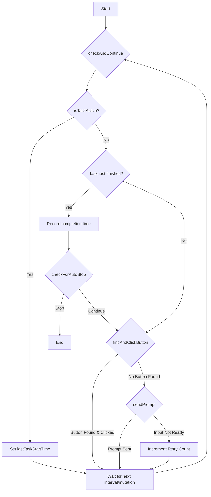

# Architecture Document: VS Code Copilot Auto-Continue

## 1. Introduction
This document provides the technical architecture for the `VS Code Copilot Auto-Continue` script. It details the system's components, their interactions, and the implementation strategy required to meet the product requirements. The architecture is designed to be a single, self-contained JavaScript file, injected into a browser environment, with a focus on simplicity, resilience, and minimal performance overhead.

## 2. Architectural Principles
- **Simplicity**: The entire system is encapsulated within a single JavaScript file (`auto-continue.js`) to ensure ease of deployment and maintenance. There are no external dependencies or build steps.
- **Resilience**: The script employs a multi-selector strategy to mitigate the risk of breakage due to minor UI changes in the target application (VS Code).
- **Performance**: The design prioritizes low-impact, asynchronous operations and throttled checks to avoid degrading the user's browsing experience.
- **Modularity**: Although a single file, the script is logically divided into distinct functional units: Configuration, State Management, DOM Interaction, and Control Flow.

## 3. System Components
The system is composed of several key functions and data structures working in concert.

### 3.1. Configuration
- **Constants**:
    - `BUTTON_COOLDOWN_MS`: `3000` - An integer representing the minimum time in milliseconds between consecutive button clicks to prevent rapid-fire actions.
    - `CHECK_INTERVAL`: `5000` - An integer defining the frequency in milliseconds of the main polling loop.
    - `MAX_RETRIES`: `3` - An integer defining how many times the script will attempt to find an action before resetting.
    - `AUTO_STOP_THRESHOLD`: `3` - An integer representing the number of consecutive fast tasks required to trigger an auto-stop.
    - `FAST_TASK_DURATION_MS`: `20000` - An integer defining the maximum duration in milliseconds for a task to be considered "fast".
    - `BUTTONS_TO_CLICK`: An array of objects, where each object defines a target button.
        - `name`: A string for logging purposes (e.g., 'Continue').
        - `selectors`: An array of CSS selector strings used to identify the button.

### 3.2. State Management
- **Variables**:
    - `lastClick`: A timestamp (integer) tracking the last successful button click.
    - `isProcessing`: A boolean flag to prevent concurrent execution of the main logic.
    - `intervalId`: A nullable integer holding the ID of the main `setInterval` loop.
    - `observer`: A nullable `MutationObserver` instance.
    - `retryCount`: An integer to track consecutive failed attempts to find an action.
    - `debugMode`: A boolean to toggle verbose logging.
    - `taskCompletionTimes`: An array of timestamps (integers) used to track the completion time of the last few tasks.
    - `lastTaskStartTime`: A timestamp (integer) to mark when the AI last started processing.

### 3.3. Core Functions (DOM Interaction)
- **`isTaskActive()`**:
    - **Purpose**: To determine if the AI is currently processing a request.
    - **Implementation**: Queries the DOM for a predefined list of CSS selectors (`activeIndicators`) that signify a loading or processing state (e.g., `.codicon-loading`, `[aria-busy="true"]`). It filters for visible elements and returns `true` if any are found.
    - **Returns**: `boolean`.
- **`isInputReady()`**:
    - **Purpose**: To find a usable chat input field.
    - **Implementation**: Iterates through a list of CSS selectors (`inputSelectors`) to find a visible, enabled `textarea` or `contenteditable` element within the chat interface.
    - **Returns**: A DOM element or `null`.
- **`sendPrompt()`**:
    - **Purpose**: To enter the continuation prompt into the chat input and submit it.
    - **Implementation**:
        1. Calls `isInputReady()` to get the input element.
        2. Sets the `value` or `textContent` of the input to the hard-coded prompt string.
        3. Dispatches `input`, `change`, and `keyup` events to simulate user entry.
        4. Queries for a "Send" button and clicks it. If no button is found, it dispatches `keydown` events for the "Enter" key as a fallback.
    - **Returns**: `Promise<boolean>`.
- **`checkForAutoStop()`**:
    - **Purpose**: To determine if the script should automatically stop based on task completion speed.
    - **Implementation**:
        1. Checks if `taskCompletionTimes` contains at least `AUTO_STOP_THRESHOLD` entries.
        2. If so, it calculates the duration of the last `AUTO_STOP_THRESHOLD` tasks.
        3. If all of these tasks have a duration less than `FAST_TASK_DURATION_MS`, it calls `autoContinue.stop()`.
    - **Returns**: `void`.
- **`findAndClickButton()`**:
    - **Purpose**: To find and click one of the target action buttons.
    - **Implementation**:
        1. Checks if the `BUTTON_COOLDOWN_MS` has elapsed since `lastClick`.
        2. Iterates through the `BUTTONS_TO_CLICK` array. For each button configuration, it queries the DOM using the associated `selectors`.
        3. It finds the first visible, enabled button and dispatches a `click` event on it.
        4. Sets the `data-auto-continue-clicked` attribute to prevent re-clicking the same button.
    - **Returns**: `boolean`.

### 3.4. Control Flow
- **`init()`**:
    - **Purpose**: To initialize the script and start the automation.
    - **Implementation**:
        1. Sets up the main `setInterval` loop, which calls `checkAndContinue` every `CHECK_INTERVAL` milliseconds.
        2. Creates and starts a `MutationObserver` (`setupMutationObserver`) to trigger `checkAndContinue` on relevant DOM changes.
        3. Exports the `autoContinue` object to the `window` scope.
- **`checkAndContinue()`**:
    - **Purpose**: The main logical loop of the script.
    - **Implementation**:
        1. Sets the `isProcessing` flag to `true`.
        2. Calls `isTaskActive()`.
        3. If a task is active, `lastTaskStartTime` is set.
        4. If a task is *not* active:
            a. If `lastTaskStartTime` is set, a task has just completed. The completion time is pushed to `taskCompletionTimes` and `lastTaskStartTime` is reset.
            b. Calls `checkForAutoStop()`.
            c. Calls `findAndClickButton()`.
            d. If no button was clicked, it calls `sendPrompt()`.
            e. If no action was taken, it increments `retryCount`.
        5. Resets the `isProcessing` flag to `false`.
- **`autoContinue` object**:
    - **Purpose**: To expose public methods for controlling the script from the browser console.
    - **Interface**:
        - `start()`: Calls `init()`.
        - `stop()`: Clears the interval and disconnects the observer.
        - `restart()`: Calls `stop()` then `start()`.
        - `debug()`: Logs the current state and configuration.

## 4. Data Flow
The data flow is cyclical and driven by the state of the VS Code UI.

## 5. Deployment and Execution
- **Deployment**: The system is deployed by delivering the single `auto-continue.js` file.
- **Execution**: The script is intended to be injected into the active VS Code web session via browser developer tools (e.g., the console) or a browser extension like Tampermonkey. It self-initializes upon execution.

## 6. Future Considerations
- **Configuration via JSON**: To make the script more flexible, the configuration constants could be externalized into a JSON object that is passed to the `init` function. This would allow users to customize selectors and timings without editing the script's source code.
- **State Machine**: For more complex scenarios, the simple `isProcessing` flag could be replaced with a more formal state machine (e.g., `IDLE`, `WAITING_FOR_AI`, `CLICKING_BUTTON`, `SENDING_PROMPT`) to make the control flow more robust.
